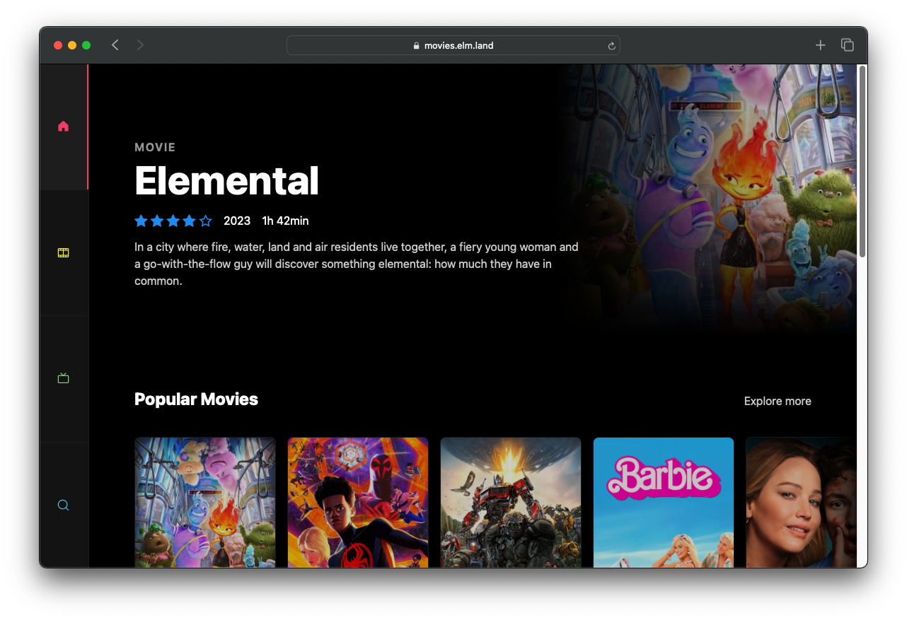

# @elm-land/movies
> An implementation of the [TasteJS Movies](https://tastejs.com/movies) learning app, powered by [the TMDB API](https://www.themoviedb.org/), with a design inspired by the [Nuxt Movies example](https://github.com/nuxt/movies).


## Introduction

The goal of this repository is to show you how to use [Elm Land](https://elm.land) to build a real web application. 



If you're new to Elm Land, or even frontend web development in general, come join the [Elm Land Discord](https://join.elm.land) and say hello! 🌈


## Try it out!

Here's how you can run this web application locally on your own machine:

1. Make sure [Node.js v18+](https://nodejs.org/) is installed
1. Rename the existing `.env.example` file to `.env`, and provide your [own TMDB API token](https://developers.themoviedb.org/3/getting-started/introduction). 

    Here's a quick example of what your file should look like once you get a real API token:

    ```sh
    # https://developers.themoviedb.org/3/getting-started/introduction
    TMDB_API_TOKEN="eyJhbGciOiJIU9......94_1RbDIf3kQ1vgB-I4"
    ```

1. Run the Elm Land server:
    ```
    npx elm-land server
    ```

1. Open `http://localhost:1234` in your web browser, and that's it!

## Project structure

This entire application is built with Elm, CSS, and a bit of JS code. Here's how the project is organized:

```elm
- elm.json          -- 🌐 Our project dependencies
- src/
  |- Pages/        -- 📑 Pages match up with URL paths
  |- Components/   -- 🧱 Navbars, footers, carousels, etc
  |- Layouts/      -- 🍱 Layouts used by many pages
  |- Api/          -- 🔄 Code that uses The Movie Database API
  |- interop.js    -- 🫂 Allows our Elm app to call JS code
- static/
  |- images/...    -- 📸 Icons and image assets
  |- main.css      -- 🎨 Defines all our styles
```

You can also learn more about how specific files work in [the official Elm Land guide](https://elm.land/guide)!

## Special thanks

- [TasteJS](https://tastejs.com/movies) - For providing a resource for folks to learn how to build web apps
- [Nuxt Community](https://github.com/nuxt/movies) - For sharing a beautiful, responsive design to get inspiration from
- [TMDB](https://www.themoviedb.org/) - For your awesome API, and great developer documentation# movies
